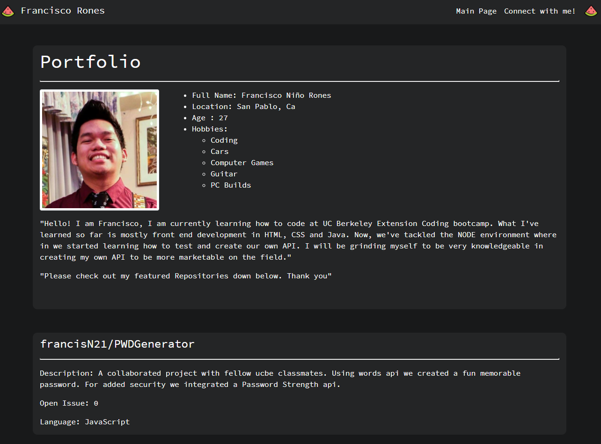

# PortfolioSite

This site had evolved from a basic html porfolio to a react web app and now it uses GITHUB api to fetch my information from my repo and translate automatically to my portoflio site.

This is my main website for featuring my greatest github repositories created for UCB bootcamp.
This contains my info and resume for employers to take.

https://francisn21.github.io/NewAgeMySpace/

License under [MIT License](License)

## Technology

```
HTML, CSS
Javascript for API fetch for my github repository featuring 3 of my best creation.
React.js

```

### Screenshot


